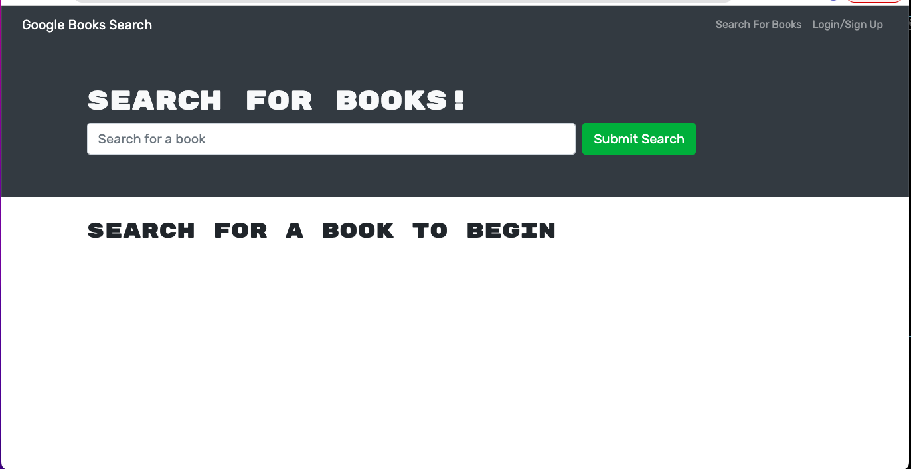

# Book Search Engine

The Book Search Engine's purpose is to help readers find new books to read based on what their interested in. Users are able to search any book title they want and the engine will populate with books that match that title. Users also have the ability to sign up for a user account of the site so they are able to log in and log out whenever they want. The Book Search Engine also provide users the ability to save books to their user profile so they have a collection of saved books to choose from. Users can also remove a book from their saved list.

# Screenshot

# Deployed Application 

[Heroku] (https://mighty-castle-95380.herokuapp.com/)
